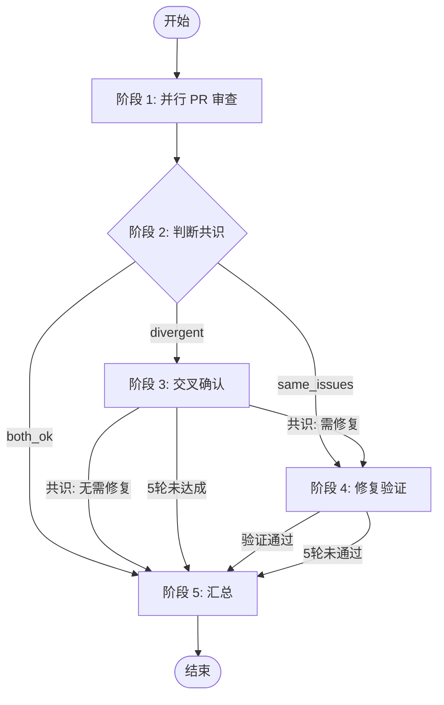
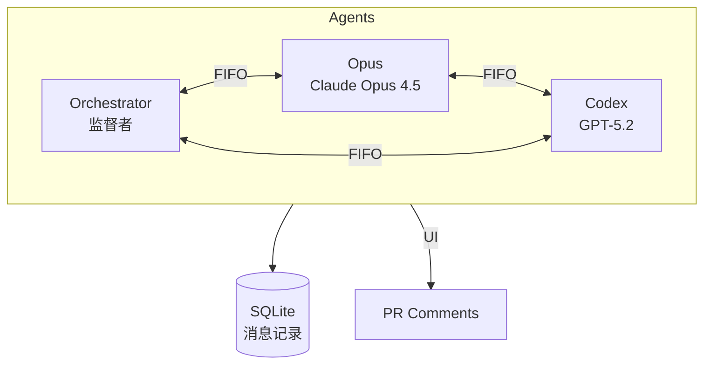

# Duo Review - 双 Agent 交叉审查

## 1. 启动检测 ⚠️

执行 `echo $RUNNER` 检测环境变量：

**有输出** → Orchestrator daemon 启动，直接执行阶段流程

**无输出** → 用户直接启动（终端 droid），进入交互模式：

1. 执行 `gh pr view --json id,number,baseRefName,headRefName,headRepositoryOwner,headRepository` 获取 PR 信息
2. 向用户确认："检测到 PR #XX (head → base)，开始审查？"
3. 用户确认后，先 export 环境变量再执行 `duo-cli init`：

   ```bash
   export RUNNER=droid
   export DROID_REPO="owner/repo"
   export DROID_PR_NUMBER=123
   export DROID_BRANCH="feat/xxx"
   export DROID_BASE="main"
   export DROID_PR_NODE_ID="PR_kwXXX"
   duo-cli init
   ```

4. 若检测不到 PR，询问用户输入 PR 编号

**⚠️ 执行 `duo-cli init` 后立即停止！**

`duo-cli init` 会启动 Orchestrator daemon（有 FIFO），由 daemon 执行后续所有阶段。
当前终端 droid 没有 FIFO，无法接收 Agent 消息，**禁止继续执行任何 duo-cli 命令**。

可选：告知用户 "Orchestrator 已启动，可用 `tail -f /tmp/duo-xxx.log` 查看进度"

---

## 2. 角色

| 角色             | 模型                | 职责                           |
| ---------------- | ------------------- | ------------------------------ |
| **Orchestrator** | 执行 skill 的 droid | 编排流程、判断共识、决定下一步 |
| **Opus**         | Claude Opus 4.5     | PR 审查、交叉确认、执行修复    |
| **Codex**        | GPT-5.2             | PR 审查、交叉确认、验证修复    |

---

## 3. 流程总览



### 阶段执行

**每个阶段执行前，必须先读取对应角色的 stages/ 文件获取详细指令！**

| 阶段 | Orchestrator                        | Opus                        | Codex                        |
| ---- | ----------------------------------- | --------------------------- | ---------------------------- |
| 1    | `1-pr-review-orchestrator.md`       | `1-pr-review-opus.md`       | `1-pr-review-codex.md`       |
| 2    | `2-judge-consensus-orchestrator.md` | (不参与)                    | (不参与)                     |
| 3    | `3-cross-confirm-orchestrator.md`   | `3-cross-confirm-opus.md`   | `3-cross-confirm-codex.md`   |
| 4    | `4-fix-verify-orchestrator.md`      | `4-fix-verify-opus.md`      | `4-fix-verify-codex.md`      |
| 5    | `5-summary-orchestrator.md`         | (不参与)                    | (不参与)                     |

---

## 4. 通信架构



- **阶段 1-2**：Opus/Codex → Orchestrator（汇报结果）
- **阶段 3**：Opus ↔ Codex 直接对话（交叉确认）
- **SQLite** - 所有消息自动记录
- **评论** = 纯 UI（给人看）

### 消息格式

**Agent 间消息**（`duo-cli send` 自动包裹 `<MESSAGE>` 标签）：

```bash
# 发送时只需写消息内容
duo-cli send orchestrator "审查完成，无问题"

# duo-cli 会自动包裹为：
# <MESSAGE from="opus" to="orchestrator">
# 审查完成，无问题
# </MESSAGE>
```

**用户 @Mention**（由 workflow 注入，不包裹）：

```xml
<USER_MENTION repo="owner/repo" pr="123" author="username">
用户评论内容...
</USER_MENTION>
```

**回复用户**（通过 PR 评论，不是 FIFO）：

```bash
duo-cli comment post "回复内容"
```

**PR 评论**（给人看，必须包含 HTML 注释标识）：

```markdown
<!-- duo-{agent}-{type} -->
##  {Title}
> 🕐 {TIMESTAMP}

{内容}
```

常用标识：`duo-opus-r1`, `duo-codex-r1`, `duo-opus-fix`, `duo-codex-verify`, `duo-summary`, `duo-mention-reply`

---

## 5. Orchestrator 行为规范

**角色：监督者 + 仲裁者**

- 启动流程，分配任务
- 监控进度（通过 `duo-cli messages` 查询）
- 在僵局时介入仲裁

**禁止：**

- 读取 PR diff、REVIEW.md、代码文件
- 等待 Agent 时执行任何命令（FIFO 消息会丢失！）

**必须：**

- 启动 Agent 后直接回复"等待中..."然后结束回复
- Agent 结果会自动作为新消息发来

---

## 6. CLI 命令

| 命令                               | 用途         | 示例                                     |
| ---------------------------------- | ------------ | ---------------------------------------- |
| `duo-cli set <key> <value>`        | 设置状态     | `duo-cli set stage 2`                    |
| `duo-cli get <key>`                | 获取状态     | `duo-cli get stage`                      |
| `duo-cli spawn <agent>`            | 启动 Agent   | `duo-cli spawn opus`                     |
| `duo-cli resume <agent>`           | 恢复 Agent   | `duo-cli resume orchestrator`            |
| `duo-cli send <agent> <msg>`       | 发消息       | `duo-cli send opus "Review done"`        |
| `duo-cli messages`                 | 查看消息历史 | `duo-cli messages --agent opus`          |
| `duo-cli status`                   | 查看状态     | `duo-cli status`                         |
| `duo-cli comment post <body>`      | 发布评论     | `duo-cli comment post --stdin`           |
| `duo-cli comment list`             | 列出评论     | `duo-cli comment list`                   |
| `duo-cli comment edit <id> <body>` | 编辑评论     | `duo-cli comment edit IC_xxx --stdin`    |

---

## 7. 状态 Keys

```plain
# 元信息
stage               当前阶段 (1-5 或 done)
pr_node_id          PR GraphQL ID

# Session（duo-cli spawn 自动管理）
{agent}:session, {agent}:fifo, {agent}:pid, {agent}:log, {agent}:model

# 阶段 2
s2:result           both_ok | same_issues | divergent

# 阶段 4
s4:branch, s4:round

# @Mention
mention:status      idle | processing | done
```

---

## 8. @Mention 处理

收到 `<USER_MENTION>` 消息时，读取 `stages/0-mention-orchestrator.md`。
