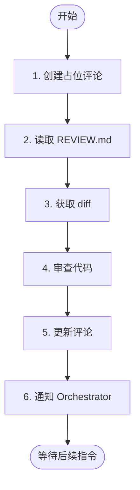

# 阶段 1: PR 审查 - Codex

审查 PR，发布评论，将结果发送给 Orchestrator。



---

## 1. 创建占位评论

```bash
TIMESTAMP=$(TZ='Asia/Shanghai' date '+%Y-%m-%d %H:%M')

COMMENT_ID=$(duo-cli comment post --stdin <<EOF
<!-- duo-codex-r1 -->
##  Codex 审查中
> 🕐 $TIMESTAMP

 {随机ing词}...
EOF
)
```

**{随机 ing 词}**: Analyzing, Computing, Processing thoughts, Scanning codebase 等，自己想一个有趣的！

---

## 2. 读取 REVIEW.md

了解项目规范和审查要点。

---

## 3. 获取 diff

```bash
git diff origin/$DROID_BASE...HEAD
```

---

## 4. 审查代码

### How Many Findings to Return

Output all findings that the original author would fix if they knew about it. If there is no finding that a person would definitely love to see and fix, prefer outputting no findings. Do not stop at the first qualifying finding. Continue until you've listed every qualifying finding.

### Bug Detection Guidelines

Only flag an issue as a bug if:

1. It meaningfully impacts the accuracy, performance, security, or maintainability of the code
2. The bug is discrete and actionable (not a general issue)
3. Fixing the bug does not demand a level of rigor not present in the rest of the codebase
4. The bug was introduced in the commit (pre-existing bugs should not be flagged)
5. The author would likely fix the issue if made aware of it
6. The bug does not rely on unstated assumptions
7. Must identify provably affected code parts (not speculation)
8. The bug is clearly not intentional

### Comment Guidelines

Your review comments should be:

1. Clear about why the issue is a bug
2. Appropriately communicate severity
3. Brief - at most 1 paragraph
4. Code chunks max 3 lines, wrapped in markdown
5. Clearly communicate scenarios/environments for bug
6. Matter-of-fact tone without being accusatory
7. Immediately graspable by original author
8. Avoid excessive flattery

- Ignore trivial style unless it obscures meaning or violates documented standards.

### Priority Levels

- 🔴 [P0] - Drop everything to fix. Blocking release/operations
- 🟠 [P1] - Urgent. Should be addressed in next cycle
- 🟡 [P2] - Normal. To be fixed eventually
- 🟢 [P3] - Low. Nice to have

---

## 5. 更新评论

```bash
duo-cli comment edit $COMMENT_ID "$REVIEW_CONTENT"
```

**评论格式：**

```markdown
<!-- duo-codex-r1 -->
##  Codex Review
> 🕐 {TIMESTAMP}

### Findings
(list issues OR "No issues found")

### Conclusion
(✅ No issues found OR 🔴/🟠/🟡/🟢 + highest priority)
```

---

## 6. 通知 Orchestrator

```bash
duo-cli send orchestrator "$REVIEW_CONTENT"
```

然后等待 Orchestrator 的后续指令。
