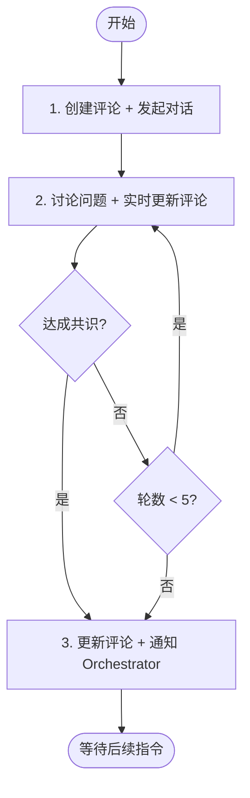

# 阶段 3: 交叉确认 - Opus

和 Codex 直接对话，对每个问题达成共识。

## 你的职责

1. 创建并维护交叉确认评论（实时更新对话内容）
2. 与 Codex 通过 FIFO 对话
3. 达成共识后通知 Orchestrator



---

## 1. 创建评论 + 发起对话

```bash
TIMESTAMP=$(TZ='Asia/Shanghai' date '+%Y-%m-%d %H:%M')

# 1. 创建评论（占位，展示初始状态）
duo-cli comment post --stdin <<EOF
<!-- duo-cross-confirm -->
## 🤝 交叉确认
> 🕐 $TIMESTAMP

### 讨论中...

 **Opus**: 分析问题中...
EOF

# 2. 保存评论 ID（comment post 会输出 ID）
duo-cli set s3:comment_id $COMMENT_ID

# 3. 发起对话（触发 Codex）
duo-cli send codex --stdin <<EOF
## 交叉确认

我们需要讨论以下问题：

$ISSUES_LIST

请逐个确认你的判断：
- 🔧 Fix - 确认需要修复
- ⏭️ Skip - 跳过（误报/不值得修复）

阅读 ~/.factory/skills/duoduo/stages/3-cross-confirm-codex.md 执行。
EOF
```

---

## 2. 讨论问题 + 实时更新评论

每收到 Codex 回复后，**立即更新评论**追加对话内容：

```bash
TIMESTAMP=$(TZ='Asia/Shanghai' date '+%Y-%m-%d %H:%M')
COMMENT_ID=$(duo-cli get s3:comment_id)

duo-cli comment edit $COMMENT_ID --stdin <<EOF
<!-- duo-cross-confirm -->
## 🤝 交叉确认
> 🕐 $TIMESTAMP

### 讨论中...

 **Opus**: 我认为 C1 需要修复，理由是...

 **Codex**: 同意 C1。对于 C2...

 **Opus**: C2 也同意，达成共识。
EOF
```

对每个问题讨论并达成共识：

- 🔧 Fix - 确认需要修复
- ⏭️ Skip - 跳过（误报/不值得修复）

最多 5 轮对话。

---

## 3. 更新评论 + 通知 Orchestrator

**达成共识：**

```bash
TIMESTAMP=$(TZ='Asia/Shanghai' date '+%Y-%m-%d %H:%M')
COMMENT_ID=$(duo-cli get s3:comment_id)

# 1. 更新评论为最终结果
duo-cli comment edit $COMMENT_ID --stdin <<EOF
<!-- duo-cross-confirm -->
## 🤝 交叉确认完成
> 🕐 $TIMESTAMP

### 对话记录

 **Opus**: ...

 **Codex**: ...

### 结论

| 问题                   | 状态    | 说明          |
| ---------------------- | ------- | ------------- |
| C1 [P2] 规则与示例矛盾 | 🔧 Fix  | 双方同意      |
| C2 [P3] 示例笔误       | 🔧 Fix  | 双方同意      |
EOF

# 2. 通知 Orchestrator
duo-cli send orchestrator --stdin <<EOF
## 交叉确认完成

| 问题                   | 状态   | 说明          |
| ---------------------- | ------ | ------------- |
| C1 [P2] 规则与示例矛盾 | 🔧 Fix | 双方同意      |
| C2 [P3] 示例笔误       | 🔧 Fix | 双方同意      |
EOF
```

**僵局：**

```bash
TIMESTAMP=$(TZ='Asia/Shanghai' date '+%Y-%m-%d %H:%M')
COMMENT_ID=$(duo-cli get s3:comment_id)

# 1. 更新评论
duo-cli comment edit $COMMENT_ID --stdin <<EOF
<!-- duo-cross-confirm -->
## 🤝 交叉确认结束（僵局）
> 🕐 $TIMESTAMP

### 对话记录
...

### 结论

| 问题 | 状态       | 说明                         |
| ---- | ---------- | ---------------------------- |
| C1   | 🔧 Fix     | 双方同意                     |
| C2   | ⚠️ Deadlock | Opus: 需修复 / Codex: 不需要 |

需人工审查 C2。
EOF

# 2. 通知 Orchestrator
duo-cli send orchestrator --stdin <<EOF
## 交叉确认结束（僵局）

| 问题 | 状态       | 说明                         |
| ---- | ---------- | ---------------------------- |
| C1   | 🔧 Fix     | 双方同意                     |
| C2   | ⚠️ Deadlock | Opus: 需修复 / Codex: 不需要 |
EOF
```
