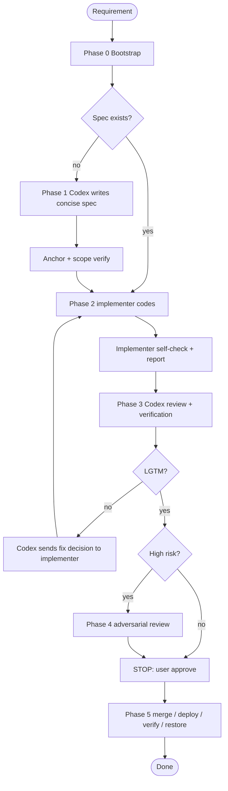

# Codex-Driven Development

Role split: **Codex** = orchestrator + spec + decision owner + reviewer. **Implementation pane** (usually Claude Code) = code changes + self-test + PR author. Communication uses tmux plus `/tmp/` shared files.

Default implementation boundary: for non-trivial code changes, Codex must not implement directly. Codex writes the spec, dispatches to the implementation pane, reviews with real verification, and only performs tiny docs/config/process-record edits itself unless the user explicitly says Codex should write the code.

Design posture: simple, reliable, SOLID enough. Do not turn a feature spec into an architecture paper. Avoid over-abstraction and excessive defensive branches; use vibe coding speed for small iterations, working checkpoints, tests, and review feedback.

War stories and root-cause incidents live in `LESSONS.md`. This file is the action checklist.

## Workflow



## Phase 0: Bootstrap

Before work starts:

1. **Select `IMPL_PANE`**: same tmux session, same window, same repo `pwd`.
   ```bash
   tmux display-message -p 'session=#{session_name} window=#{window_index} pane=#{pane_index} pwd=#{pane_current_path}'
   tmux list-panes -a -F '#{session_name}:#{window_index}.#{pane_index} #{pane_current_command} #{pane_current_path}' | rg 'claude|claude-code'
   tmux split-window -t <session>:<window> -h <implementation-command>
   ```
   Do not pick a pane from another session/window/path. If the implementation agent is not Claude Code or the command name is unclear, ask the user for the pane/launch command instead of guessing.
2. **Permissions**: implementation pane must have the needed write/tool permissions before work starts.
3. **Bidirectional comms**: tell the implementer the Codex pane ID. Create `/tmp/codex_orchestrator_${ANCHOR_ID}.md` with Task / Phase / Codex pane / implementer pane / Spec path / PR scope / decision log.
4. **Progress file**: implementer updates `/tmp/impl_progress_<task>.md` for long work: done / doing / blocked.

Comms rules:

- **Instruction-first discipline**: explicit workflow/user instructions are the default execution boundary. If Codex believes a workflow is inefficient, risky, or suboptimal, Codex must stop and present the issue, alternatives, tradeoffs, and recommendation to the user or decision owner before changing behavior. General productivity habits, "better control", or "more visibility" never justify silently bypassing the protocol.
- **No silent optimization**: Codex may propose workflow improvements, but may not apply them implicitly. A local optimization is allowed only after authorization or when a higher-priority safety red line blocks the original instruction; in the latter case Codex must state the conflict and the substituted path.
- `tmux send-keys` text and Enter are separate calls with `sleep 2`.
- Implementer must actively notify Codex when done or blocked; Codex should not rely on pane polling as the normal feedback loop.
- Long silence over 10 minutes: ask for status; do not infer half-written output.
- **Pipeline discipline**: After dispatching Phase 1 spec, Codex may begin Phase 1 for the next queued task, but must not hold more than 2 active tasks simultaneously. Codex reviews on implementer notification, not by polling. When switching to review, fully load that task's context before starting.

## Phase 1: Codex Writes Spec

Codex owns requirement understanding. If the goal is unclear, clarify before sending work to the implementer. If the goal is clear but the path is not the shortest reliable path, state the better path and use it.

Spec must be concise and implementable:

| Section | Purpose |
|---------|---------|
| Goals + Non-goals | Scope fence |
| PR Scope | Explicit PR-A boundary; what is out of scope |
| Acceptance Criteria | Verifiable checkpoints |
| Contracts / Impact | Changed state, field meaning, API behavior, readers/writers/dependents with `file:line` anchors when relevant |
| Implementation Plan | Files, rough line count, sequencing, known edge cases |
| Validation Plan | Targeted build/test/vet/manual checks matched to change size |
| Spend Gate (if cost-bearing) | Spend level, cost estimate/cap, input semantic check, smoke/canary result, stop condition, cleanup/artifacts |
| Risks + Rollback | Only material risks; no defensive boilerplate |
| Decision Log | Decisions already made by Codex and evidence |

High-risk flags that require full spec + review: concurrency, state machine, CAS/optimistic lock, distributed lock, cross-service contract, DB schema, data backfill/resurrection, auth/security, performance hot path, production rollout.

DB boundary work must include the project-required Writer Matrix before implementation.

Bug-fix specs must distinguish stop-bleed status, root-cause target, fix scope, and regression validation. A mitigation alone is not a completed bug fix unless Codex records why root-cause work is out of scope.

Cost-bearing work must include a Spend Gate before execution. This covers GPU/ECS/ACS/ACK, paid SaaS APIs, batch LLM/embedding, crawler/refresh/backfill runs, email/SMS sends, large OSS/RDS/Milvus/Redis usage, and deployments that enable high-frequency paid workers or cron jobs.

### Anchor Verify

Before implementation starts, Codex verifies spec anchors:

```bash
rg -o '`[^`]+`' "$SPEC_FILE" | sort -u
# Check referenced files/symbols with rg/sg/ls as appropriate.
```

Dead anchor or stale contract means fix the spec first; do not dispatch implementation.

### Spend Gate

Use this gate before any action that can spend external money or keep paid resources running.

| Level | Trigger | Required action |
|-------|---------|-----------------|
| L0 | Local only, no external cost | No gate |
| L1 | Expected cost < ¥10, one-shot | Record objective, resource, cleanup |
| L2 | ¥10-100, batch, or long-running | Preflight artifact required before paid run |
| L3 | > ¥100, production batch, or persistent resource | User confirms budget cap and stop condition |
| L4 | Continuous spend or platform-level resource | Separate spec with owner, metrics, alerts, rollback |

Preflight artifact for L2+:

- Objective and value hypothesis: what decision this spend should unlock.
- Input semantic check: sample rows, label distribution, schema, and target meaning are verified against the business goal.
- Cost estimate and cap: model/resource price, expected count/runtime, worst acceptable spend.
- Smoke/canary: smallest paid or realistic run that validates both mechanics and semantics.
- Stop condition: metric, timeout, error rate, or spend threshold that stops the run.
- Cleanup/rollback: resource release, switch restore, data/artifact retention path.
- Actual run record: resource id, runtime, estimated cost, output path, anomalies.

Codex cannot approve a paid run from implementer self-report alone. Codex must independently inspect the preflight artifact, smoke output, and cost cap. "It runs" is insufficient when the spend goal depends on data meaning, labels, model output, or downstream quality.

## Phase 2: Implementer Codes

Send the implementer the spec path and this implementation prompt. The implementer may ask Codex for decisions; the implementer must not ask the user directly during implementation.

```markdown
## Ground Truth

Read `<SPEC_PATH>` first. Spec is the source of truth. If spec conflicts with code, stop and ask Codex orchestrator with evidence.

## Red Lines

- 禁止 `git -C`
- 禁止直接 push main，必须 branch -> PR
- 禁止 `--no-verify` / `--no-gpg-sign`
- 禁止默认跑全量 `make verify`；按 spec 的 Validation Plan 选择验证
- 不写 placeholder / TODO / "implement this"
- 涉及外部成本的动作未过 Spend Gate 不得执行；不得直接开 GPU、批量 LLM、批量 crawl/refresh/backfill、批量邮件/短信或持久资源

## Bug Protocol

For bug tasks, execute in this order:

1. Stop bleeding first: if there is active user or production impact and a reversible, low-risk mitigation is available, propose or apply it through the authorized path before deeper RCA. Record the mitigation and restore condition.
2. Extract observable facts from the task, logs, errors, and repro steps. Do not turn guesses into facts.
3. Read the relevant implementation behind named files, functions, error codes, or call paths.
4. List 2-3 mutually exclusive hypotheses with disconfirming tests, then verify the cheapest strongest signal first.
5. Keep each hypothesis to 3-5 targeted probes or 10-15 minutes. If no evidence appears, split or discard the hypothesis instead of widening it.
6. After 30 minutes without mitigation, repro, or root-cause evidence, write `/tmp/impl_blocked_<task>.md` with stop-bleed status, excluded hypotheses, evidence, most credible direction, and missing information; notify Codex and pause or close as assigned.
7. A completed bug fix needs root-cause evidence plus a regression test or equivalent validation. Remove or restore any temporary mitigation after the fix is verified.

## Design Discipline

Keep it simple and SOLID. Do not add abstractions, config, fallback paths, or defensive code that the spec does not need. Prefer the smallest coherent change that passes the acceptance criteria.

## Decision Questions

When blocked by a technical/product choice, ask Codex orchestrator first, not the user. Include:

1. 问题
2. 可选方案
3. 看到的代码/测试证据（`file:line`、命令输出、失败日志）
4. 推荐项
5. 风险

Codex decides from the spec and evidence. Only Codex escalates to the user, and only for business goal changes, irreversible production risk, or scope clearly outside PR-A.

## PR Flow

1. Create a branch from the intended base.
2. Implement and self-test.
3. Push branch and create PR. PR body includes spec link, AC checklist, and test output summary.
4. Do not merge. Report back to Codex.

## Self-Report

Report facts only. Do not tell the reviewer what to focus on, do not provide a "suggested review checklist", and do not frame one concern as the main thing to inspect. Known risks and unverified items are still required, but they must be stated as evidence-backed facts tied to the spec, acceptance criteria, or test output.

- PR URL, branch, base commit
- Files changed and rough line count
- Test commands and PASS/FAIL details
- Acceptance Criteria: ✅/⚠️/❌ with evidence
- Decisions made inside the spec boundary
- Known risks or items not verified
- Spend Gate, if relevant: spend level, cost estimate/cap, preflight artifact path, smoke result, stop condition, cleanup result, actual resource/runtime/cost estimate

## Notify

When complete or blocked:

tmux send-keys -t <codex_pane> '<summary>'
sleep 2 && tmux send-keys -t <codex_pane> Enter
```

## Phase 3: Codex Review

Codex reviews after implementer self-report. Do not accept an implementation that has no runnable verification for the changed surface.

Independence rule: review is anchored on the spec, not the implementer narrative. Use the self-report only to locate the PR/branch/test artifacts at first. Then review in this order:

1. Read the spec and extract PR Scope, Acceptance Criteria, Contract / Impact, and Validation Plan.
2. Inspect diff, relevant code, and tests against that extracted checklist.
3. Run or reproduce the verification required by the spec.
4. Read the full implementer self-report last to cross-check claims, gaps, and discrepancies.

If the implementer names "areas to review" or suggests a review direction, treat those statements only as possible evidence to verify after the independent pass. They must not define or narrow review scope.

Review checklist:

- Diff is inside PR Scope.
- Acceptance Criteria each independently marked ✅/⚠️/❌ by Codex with evidence.
- Contract / Impact items checked against code and tests.
- Validation Plan executed, or gaps clearly justified.
- Spend Gate independently verified for cost-bearing actions; tests passing alone is not enough.
- File length, unused code, and obvious anti-patterns checked.
- DB/schema/config/deploy implications checked when touched.

Verification scope follows the spec and project validation-cost table:

| Change size | Default verification |
|-------------|----------------------|
| Light | Target package build + target test |
| Env-only | Env consistency script |
| Medium | Target package regression + relevant lint/vet |
| Heavy | Broader regression, `make verify` only when justified, canary/manual check if needed |

Review result:

| Result | Action |
|--------|--------|
| LGTM | High-risk check, then STOP gate |
| Conditional | Codex records caveats and decides continue vs fix |
| Reject | Codex sends a concrete fix prompt to implementer with evidence |

Implementer self-report is evidence, not a review agenda. Review feedback is evidence, not a command. Codex must combine spec, diff, verification, and implementer report before deciding.

## Decision Routing

During development, all non-trivial questions route through Codex:

1. Implementer sends the structured question template.
2. Codex decides based on spec + code/test evidence.
3. Codex updates the Decision Log in the anchor/spec.
4. Implementer applies the decision.

Escalate to user only when one of these is true:

- Business goal or product meaning changes.
- Production action has irreversible or hard-to-rollback risk.
- The required work clearly exceeds PR-A scope.

Everything else is Codex's job to decide.

## Phase 4: Adversarial Review

Trigger for high-risk changes: status/state transition, CAS/optimistic lock, race fix, distributed lock/lease/fencing, callback/async timing, auth/security, DB migration, cross-service contract, performance hot path, or user asks to challenge the design.

Focus review on failure paths: data loss, service interruption, security issue, rollback breakage, race windows, idempotency, fan-out amplification.

Blocker returns to Phase 2. Warning becomes an explicit caveat for the STOP gate.

## Phase 5: STOP -> Merge -> Deploy -> Verify -> Restore

All changes go through PR. No direct main push.

| Task shape | Merge target |
|------------|--------------|
| Single independent PR | main after Codex LGTM + user approval |
| Multiple PRs for one feature | integration branch `feat/<feature-name>` first |
| Multiple checkpoints / dependent PRs | one root integration branch, then main after E2E + final review |

Gate sequence:

1. STOP: tell user PR(s), review result, risks, and ask for explicit approve.
2. Merge PR(s) only after approve.
3. Before any paid rollout/run, restate Spend Gate level, budget cap, stop condition, cleanup plan, and artifact path.
4. Deploy only from allowed branch/environment.
5. Verify behavior, not just process status.
6. Restore temporary switches immediately.
7. New lesson goes to `LESSONS.md` only when it changes future behavior.

## Tmux Quick Reference

| Action | Command |
|--------|---------|
| List panes | `tmux list-panes -a -F '#{session_name}:#{window_index}.#{pane_index} #{pane_pid} #{pane_current_command} #{pane_current_path}'` |
| Send text | `tmux send-keys -t $PANE "text"` |
| Submit | `sleep 2 && tmux send-keys -t $PANE Enter` |
| Interrupt | `tmux send-keys -t $PANE C-c` |

## Role Boundaries

| Role | Who | Responsibilities |
|------|-----|------------------|
| Orchestrator | Codex | Requirement understanding, spec, decisions, phase advancement, user escalation |
| Implementer | Claude Code or assigned implementation pane | Code changes, self-test, structured questions, PR |
| Reviewer | Codex | Independent verification of implementer output |
| Adversarial reviewer | Independent reviewer/pane when available | Challenge high-risk design |

## When Not To Use

- Single-line fix
- Pure refactor with no behavior change
- No tmux, or implementation pane cannot be started/reached
- User explicitly skips spec/review

## LESSONS

See `LESSONS.md`. Add one lesson only when a new failure mode changes the checklist.
