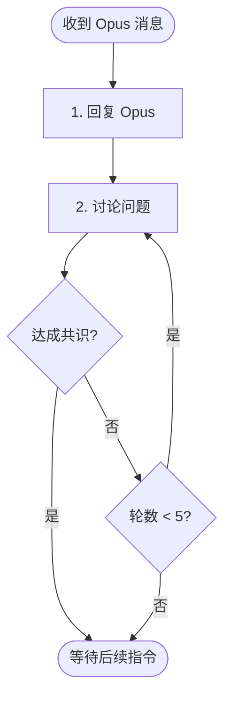

# 阶段 3: 交叉确认 - Codex

和 Opus 直接对话，对每个问题达成共识。

## 你的职责

通过 FIFO 与 Opus 对话，达成共识。

## 可用命令

```bash
duo-cli send opus "..."
```



---

## 1. 分析问题 + 回复 Opus

收到 Opus 的交叉确认消息后：

1. **重新审视每个问题** - 检查代码，独立判断
2. **给出你的判断** - 🔧 Fix 或 ⏭️ Skip
3. **回复 Opus**

```bash
duo-cli send opus --stdin <<EOF
| 问题 | 我的判断 | 说明                     |
| ---- | -------- | ------------------------ |
| C1   | 🔧 Fix   | 同意，规则和示例确实矛盾 |
| C2   | ⏭️ Skip  | 不影响功能，可以忽略     |
EOF
```

---

## 2. 讨论问题

对每个问题讨论并达成共识：

- 🔧 Fix - 确认需要修复
- ⏭️ Skip - 跳过（误报/不值得修复）

最多 5 轮对话。

如果有分歧，继续与 Opus 讨论：

```bash
duo-cli send opus --stdin <<EOF
C1 我同意需要修复。

但 C2 我认为不需要，理由是...
EOF
```

---

## 3. 等待后续指令

达成共识后，等待 Orchestrator 发送阶段 4 或阶段 5 的指令。
