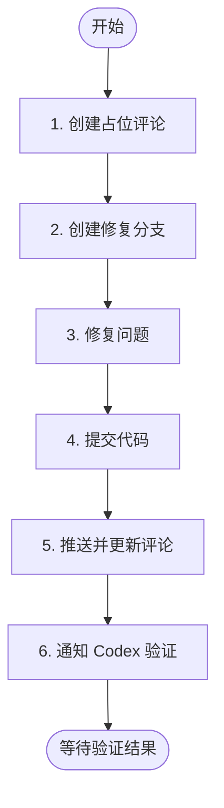

# 阶段 4: 修复 - Opus

修复阶段 3 确认的问题。



---

## 1. 创建占位评论

```bash
TIMESTAMP=$(TZ='Asia/Shanghai' date '+%Y-%m-%d %H:%M')

COMMENT_ID=$(duo-cli comment post --stdin <<EOF
<!-- duo-opus-fix -->
##  Opus 修复中
> 🕐 $TIMESTAMP

 {随机ing词}...
EOF
)
```

**{随机 ing 词}**: Fixing, Patching, Refactoring 等，自己想一个有趣的！

---

## 2. 创建修复分支

根据修复内容命名，格式：`duo/pr{NUMBER}-{desc}`

```bash
# 示例：duo/pr77-add-tenant-id, duo/pr77-fix-null-check
BRANCH="duo/pr$DROID_PR_NUMBER-{简要语义化描述}"
git checkout -b "$BRANCH"
duo-cli set s4:branch "$BRANCH"
```

---

## 3. 修复问题

根据阶段 3 确认的问题进行修复。

---

## 4. 提交代码

```bash
git add -A
git commit -m 'fix(duo): ...'
```

---

## 5. 推送并更新评论

```bash
# 禁止推送到 main
[[ "$BRANCH" == "main" || "$BRANCH" == "master" ]] && echo "ERROR: Cannot push to main/master" && exit 1
git push origin "$BRANCH" --force

# 更新评论
duo-cli comment edit $COMMENT_ID "$FIX_CONTENT"
```

**评论格式：**

```markdown
<!-- duo-opus-fix -->
##  Opus 修复完成
> 🕐 {TIMESTAMP}

### 修复内容
**Commit**: [`<short_hash>`](https://github.com/$DROID_REPO/commit/<full_hash>)

(说明修复了什么问题)

### 文件变更
(列出修改的文件及行数变更)
```

---

## 6. 切回 PR 分支并通知 Codex

```bash
git checkout $DROID_BRANCH

duo-cli send codex --stdin <<EOF
修复完成，分支: $BRANCH

请验证修复是否正确。阅读 ~/.factory/skills/duoduo/stages/4-fix-verify-codex.md 执行。
EOF
```
